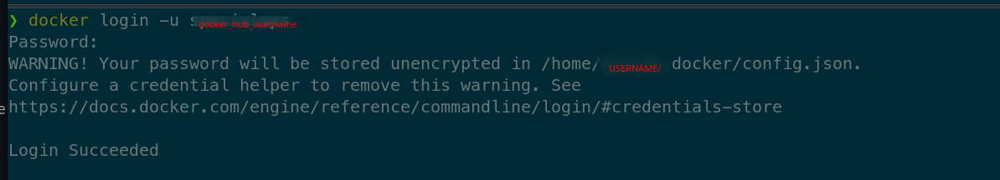
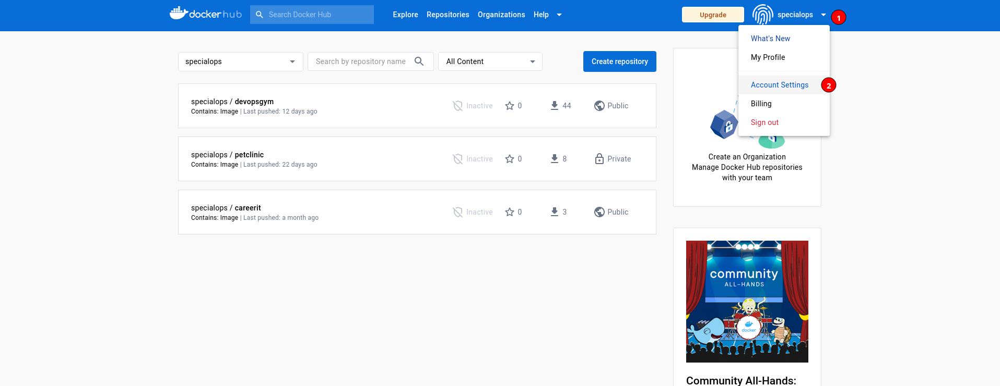
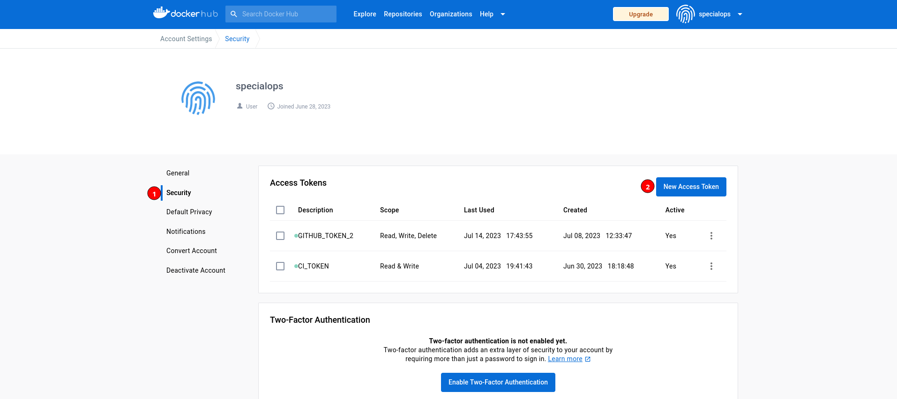
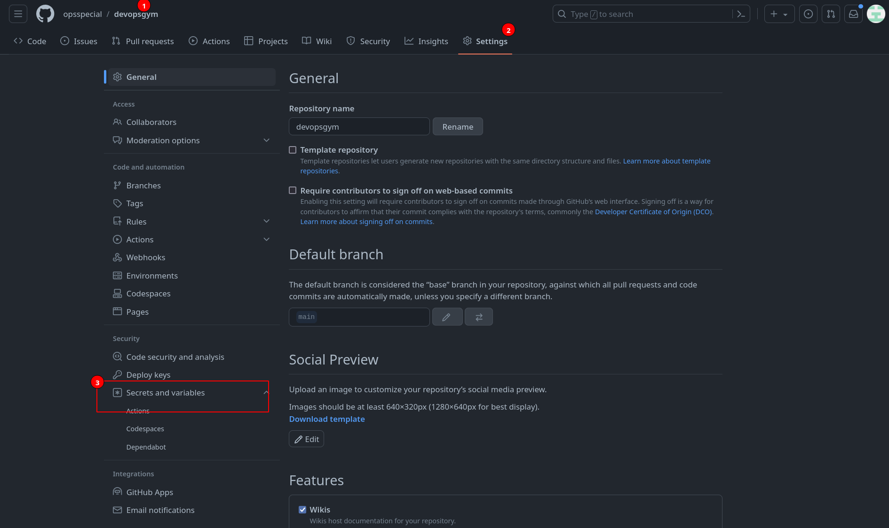
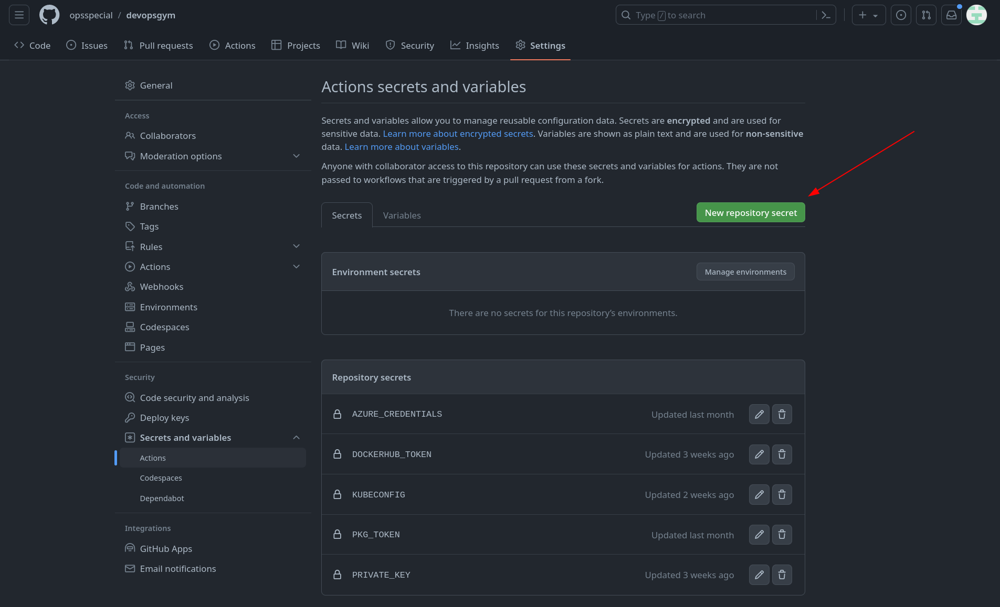

<p align="center">Create a <b>Continuous Integration/Continuous Deployment</b> pipeline to deploy a simple Java web application.<br/>Focus on GitHub Actions <b>DevOps</b>.</p>


</p><a href="https://www.docker.com/" target="_blank"></a>&nbsp;</p>


## ⚡️ Overview

## 📖 Project Structure

```
cicd-pipeline-java-webapp/
├── src/main/webapp
├── userdata/
├── .gitignore
├── .github/
├── README.MD
├── Dockerfile
└── pom.xml
```


#### pom.xml
As you can see, there is a `pom.xml` file in the GitHub repository. We will define some information for our build artifact and update the version every time we want to update our project here. You can find more information about POM [here](https://maven.apache.org/guides/introduction/introduction-to-the-pom.html#).

```
<project xmlns="http://maven.apache.org/POM/4.0.0" xmlns:xsi="http://www.w3.org/2001/XMLSchema-instance"
  xsi:schemaLocation="http://maven.apache.org/POM/4.0.0 http://maven.apache.org/maven-v4_0_0.xsd">
  <modelVersion>4.0.0</modelVersion>
  <groupId>com.mylab</groupId>
  <artifactId>MyLab</artifactId>
  <packaging>war</packaging>
  <version>0.0.1</version>
  <name>MyLab</name>
  <url>http://maven.apache.org</url>
  <dependencies>
    <dependency>
      <groupId>junit</groupId>
      <artifactId>junit</artifactId>
      <version>4.13.1</version>
      <scope>test</scope>
    </dependency>
  </dependencies>
  <build>
    <finalName>${project.artifactId}-${project.version}</finalName>
  </build>
</project>
```

To print this artifact information when we update and run the pipeline, we will use environment variables in Jenkinsfile to get context from the `pom.xml` file dynamically.
Install the plugin `Pipeline Utility Steps`:


## CI-CD Workflow 

`Build-Release` GitHub Actions workflow automates the process of building, tagging, and publishing a release for a project on the `main` branch. It determines the appropriate version to bump based on commit messages, generates a new version using semantic versioning, builds a Java project, and finally, pushes a Docker image with the updated version to Docker Hub.


## Pre-requisites:
- Azure CLI to retrieve Kubeconfig
- A Github repository 
- A Kubernetes cluster
    - KUBECONFIG to deploy application
- Container Registry (Dockerhub)
    - Credentials to publish to docker hub


### Get Kubeconfig

For this workflow, we are using an Azure Kubernetes cluster. If you have the contributor permissions, the following command can be run to get the KUBECONFIG


```bash
az aks get-credentials --name <cluster_name>  --resource-group <resource_group> --file ci_kubeconfig
```

Convert this to base64 encoded file and copy the output and update the output as value to the [GitHub Actions secret](#create-a-github-actions-secret)


### Create Image Registry Credentials

This is required for Kuberentes to pull images from the registry (in our case it is dockerhub)

- Run the following command to generate registry credentials

```bash
docker login -u <username> -p 
```


once the login is succesful create a Kubernetes secret:

```bash
kubectl create secret generic regcred \
    --from-file=.dockerconfigjson=<path/to/.docker/config.json> \
    --type=kubernetes.io/dockerconfigjson
```
Replace the `<path/to/.docker/config.json>` with the acutal path of your Docker login. the path can be seen in the output of the above command 


```bash
base64 ci_kubeconfig 

```

### Docker credentials

For the workflow to publish images, you need to give GitHub Actions the authentication detials, to do that create a Service Token from Dockerhub

1. Login to [Dockerhub](https://hub.docker.com)

2. Click on User account and click on `Account Settings`



3. Click on Security and click on `New Access Token` and give it a name and copy the secret and update it as a Github Secret with the name `DOCKERHUB_TOKEN`



## Steps Explanation:

1. **Checkout repository**:
   - This step uses the `actions/checkout` action to clone the repository to the runner machine.
   - The `fetch-depth: 0` option ensures that the full commit history is fetched, which is needed to determine the current version.

2. **Install semver**:
   - This step installs the `semver` package globally using npm.
   - `semver` is a tool used to work with semantic versioning.

3. **Determine current version**:
   - This step uses `git describe` to get the latest tag on the current branch (main).
   - It stores the current version in a variable called `current_version` and appends it to the `$GITHUB_OUTPUT` file.

4. **Determine bump type**:
   - This step retrieves the commit message for the latest commit using `git log`.
   - It analyzes the commit message to determine the appropriate version bump based on keywords.
   - If the commit message contains any of the keywords "BREAKING," "Breaking," "breaking," "BREAK," "break," or "Break," it sets the `bump_type` to "major."
   - If the commit message contains any of the keywords "FEATURE," "feature," "FEAT," or "feat," it sets the `bump_type` to "minor."
   - Otherwise, it sets the `bump_type` to "patch."
   - The `bump_type` is stored in the `$GITHUB_OUTPUT` file.

5. **Generate new version**:
   - This step uses the `semver` tool again to generate a new version based on the determined `bump_type`.
   - The new version is stored in the `NEW_TAG` environment variable and appended to the `$GITHUB_OUTPUT` file.

6. **Create tag**:
   - This step creates a Git tag using the newly generated `NEW_TAG`.
   - The tag is then pushed to the remote repository.

7. **Setup jdk**:
   - This step sets up the Java Development Kit (JDK) on the runner machine using the `actions/setup-java` action.
   - It specifies Zulu as the distribution and Java 17 as the version.

8. **Build and Publish war**:
   - This step runs the Maven `clean package` command to build the Java project and create a WAR file.

9. **Login to Docker Hub**:
   - This step uses the `docker/login-action` action to authenticate with Docker Hub using the provided username and Docker Hub token (stored as a secret).

10. **Build Docker Image**:
    - This step builds a Docker image with the updated version using the `docker build` command.
    - The Docker image is tagged with `specialops/devopsgym:$NEW_TAG`.
    - The built image is then pushed to Docker Hub using `docker push`.

11. **Update Image**:
    - This step updates the Kubernetes configuration to use the new Docker image.
    - It first decodes the `KUBECONFIG` secret (stored as a base64-encoded value).
    - The decoded `KUBECONFIG` is set as an environment variable to configure the Kubernetes client (`kubectl`).
    - The command `kubectl get nodes` is executed, which lists the nodes in the Kubernetes cluster. This step serves as an example of updating the Kubernetes configuration, and you would likely modify it based on your specific deployment needs.

## Important Notes:

- Ensure that the necessary secrets (e.g., `DOCKERHUB_USERNAME`, `DOCKERHUB_TOKEN`, `KUBECONFIG`) are set in the repository settings to enable the workflow to run successfully.
- The workflow is set up to run only on the `main` branch when a push event is triggered.
- The `permissions: write-all` attribute in the `build-publish` job indicates that the job has write access to the repository, allowing it to create tags and push changes.
- The workflow runs on an Ubuntu 22.04 runner, as specified by `runs-on: ubuntu-22.04`.

This workflow demonstrates how GitHub Actions can automate complex tasks in a CI/CD (Continuous Integration/Continuous Deployment) pipeline, from versioning to building and publishing Docker images and updating Kubernetes configurations. Modify and customize the workflow to suit your project's specific requirements and deployment environment.


## Appendix

### Create a GitHub Actions secret


To create a GitHub Actions Secret:

1. Go to the repository where you want to run the workflow
2. Click on Settings --> Secrets and Variables



3. Click on Secrets and click on *New repository secret*




4. Add the name for the secret name (ex: KUBECONFIG) and in the value add the actual value

*Good Luck!!!* 👏 👏 👏


